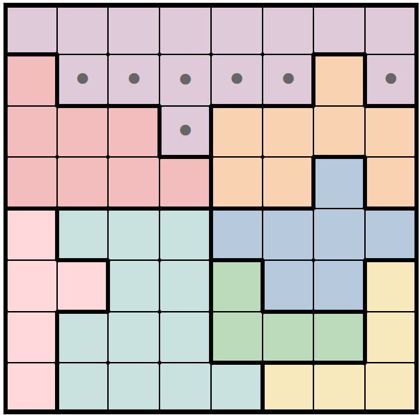
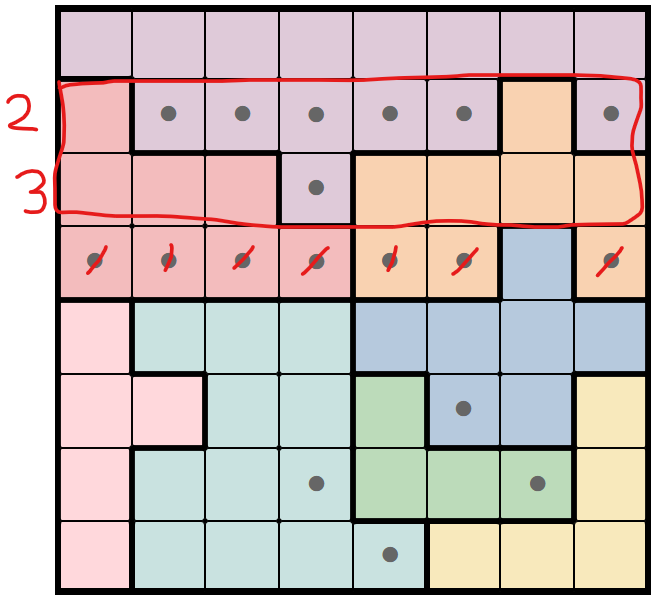
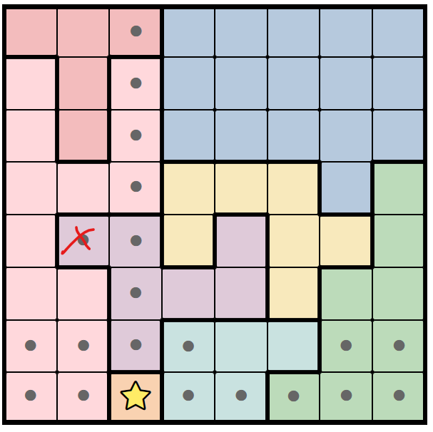
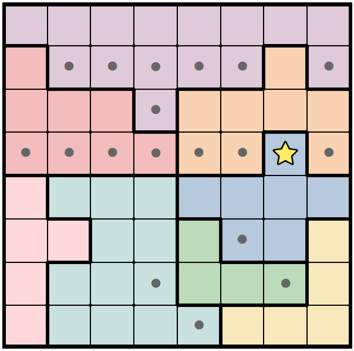
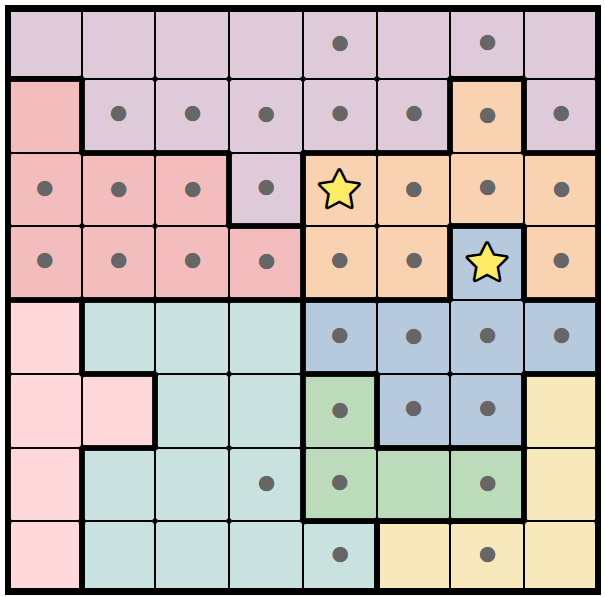
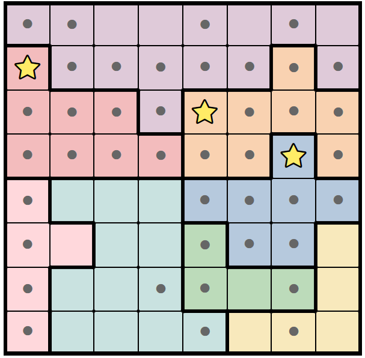
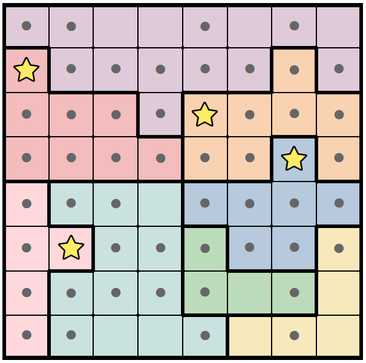
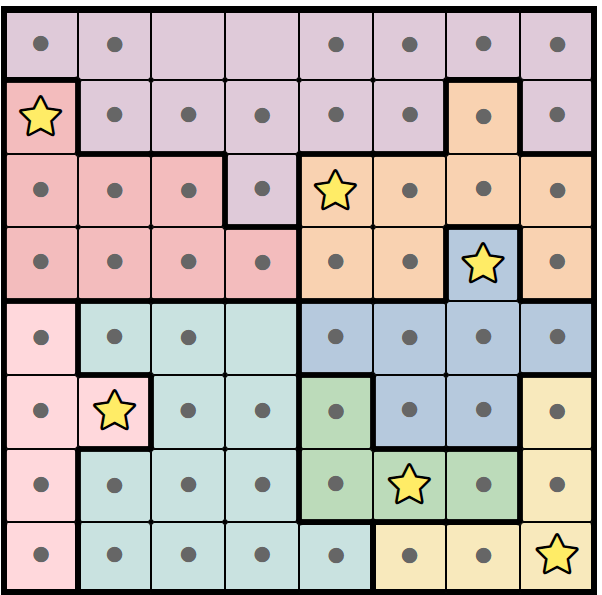
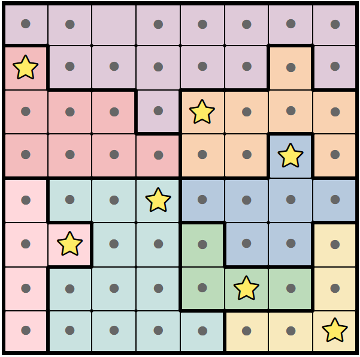
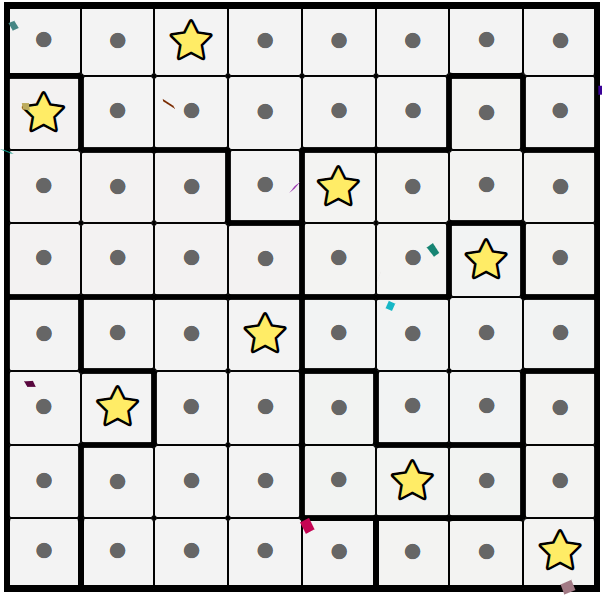

Board:

- 2D array of cells (Cell[][])
- \# of stars/queens setting i.e. 1 star, 2 star (number)

Cell:

- isStar (boolean)
- color (number)

Elimination and selection rules (1-star):

1. **Elimination: If there are only _n_ distinct valid colors in _n_ rows or columns, that means any cells of those colors outside of those rows/columns must be eliminated.** i.e. we can eliminate purple from being anywhere besides the first row, since that one row only has one valid color.
   
2. **Elimination: if all the remaining items in a group (row, column, but most commonly _color_) all exclude a cell, that cell must be eliminated.** In the below image, the yellow group excludes cell _1_ from being a star. Likewise, the green group excludes cell _2_ from being a star. After eliminating cell _1_, we can eliminate cells 3 and 4 via the green group.
   
   **Fast forward: applying rule 1**
   
3. **Elimination: Opposite of 1: If _n_ distinct colors are locked into the same _n_ rows or columns, then any other cells in those rows or columns must be eliminated.** NOTE: BELOW PICTURE IS OF A DIFFERENT PUZZLE. Because the red and pink color groups can only be in columns 1 and 2, the purple cell in column 2 can be eliminated.
   
4. **Selection: If there is only one valid cell in a row, column, or color group, then that cell must contain a star.** Because the fourth row only contains one cell, that cell must be a star.
   
5. **Elimination: Any cells in the same row, column, or color group, or diagonally touching a star must be eliminated.** Red marks represent the newly eliminated cells, and purple marks represent already invalidated cells that would've been eliminated by the rule. Idk where the picture went lol

Fast forward a few moves:
**Rule 5 + 6 applied over and over again**

